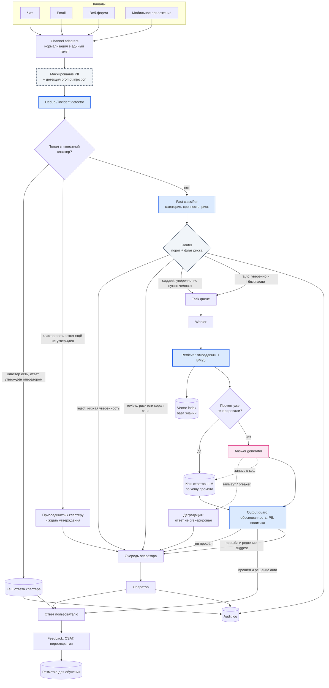
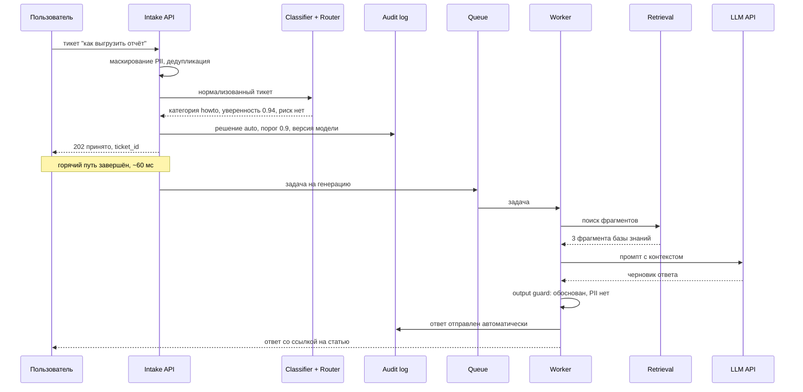
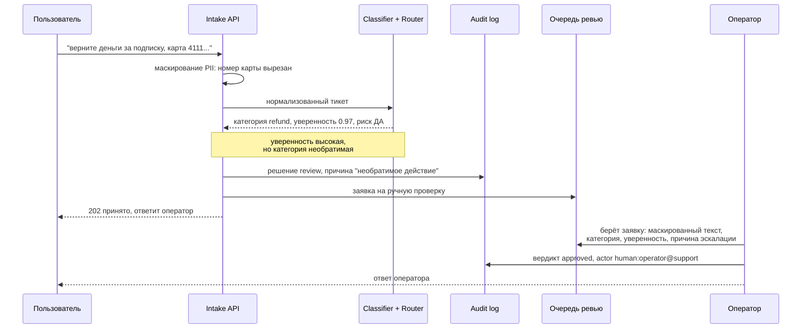

# Архитектура

## 1. Что проектируем

Система принимает обращение из любого канала, за десятки миллисекунд решает **что это и куда направить**, и отдельно, уже асинхронно, готовит **текст ответа**. Эти две задачи разделены физически, потому что у них разные требования: маршрутизация лежит на горячем пути с бюджетом 500 мс и обязана работать всегда, генерация занимает секунды и может быть недоступна.

Три инварианта, из которых выведено всё остальное:

1. **Быстрый путь не делает внешних вызовов.** Ни LLM, ни сторонние API. Иначе деградация провайдера становится деградацией приёма обращений.
2. **Необратимое решение не принимается автоматически** — независимо от уверенности модели.
3. **Каждое решение попадает в аудит до того, как ответ ушёл пользователю.** Решение, которого нет в журнале, не считается принятым.

## 2. Основные компоненты

Колонка «Чем решается» отвечает на вопрос, где нужен ML, а где он был бы лишним.

| Компонент | Ответственность | Синхронность | Чем решается |
|---|---|---|---|
| **Channel adapters** | приём из чата, email, веб-формы, мобильного приложения; приведение к единому формату тикета | синхронно | парсинг, без ML |
| **Intake API** | вход системы: приём тикета, маскирование PII, детекция инъекций | синхронно, ≤500 мс | правила; NER для имён и адресов в целевой версии |
| **Dedup / incident detector** | отпечаток обращения, поиск похожих за окно времени, признание всплеска инцидентом | синхронно |  **эмбеддинги + кластеризация**, точные повторы — хешом |
| **Fast classifier** | категория, срочность, флаг риска, оценка уверенности | синхронно |  **классическая ML: линейная модель или бустинг поверх эмбеддингов** |
| **Router** | превращает уверенность и флаг риска в решение: `auto` / `suggest` / `review` / `reject` | синхронно | **намеренно без ML** — пороги и таблица категорий |
| **Audit log writer** | запись решения с входом, версией модели, скором, порогом, актором и причиной | синхронно | без ML |
| **Task queue** | буфер медленного пути, сглаживает пики | граница | без ML |
| **Retrieval service** | гибридный поиск по базе знаний: эмбеддинги + BM25 | асинхронно |  **эмбеддинги** + лексический BM25 |
| **Answer generator** | сборка промпта и вызов LLM с таймаутом, кешем и circuit breaker | асинхронно |  **LLM** |
| **Output guard** | проверки готового ответа: обоснованность фрагментами, отсутствие PII, соответствие политике | асинхронно |  сверка утверждений с контекстом эмбеддингами; PII и политика — правилами |
| **Review queue + операторская** | очередь ручной проверки, вердикт оператора, возврат вердикта в аудит и в обучающую выборку | человек | человек |
| **Feedback collector** | вердикты операторов, переоткрытия, CSAT — источник разметки | асинхронно | без ML, но производит разметку для ML |

## 3. Поток данных

**Легенда.** Синим отмечены узлы на классическом ML — эмбеддинги, классификатор, поиск, сверка ответа с контекстом. Розовым — единственное место, где вызывается LLM. Пунктиром — узлы, которые решаются правилами намеренно, хотя соблазн поставить туда модель есть.

Из роутера выходят **четыре** стрелки, а не три: `suggest` — отдельный режим, где генерация происходит, но ответ уходит оператору черновиком, а не пользователю; именно он даёт большую часть ценности на раннем этапе раскатки. В очередь оператора ведут **шесть** стрелок: низкая уверенность, риск, ожидание утверждения кластера, режим `suggest`, провал output guard и деградация LLM. Это и есть запасные пути системы — все они сходятся в одну точку.

**Два кеша, и они разные.** Первый — **кеш ответа кластера**, на горячем пути: если обращение попало в уже отвеченный кластер, пользователь получает утверждённый оператором ответ мгновенно, генерация не вызывается вовсе. Это механизм инцидентного режима. Если кластер существует, но ответ ещё не утверждён, обращение к нему присоединяется и ждёт — одна проверка человеком закрывает потом всех сразу. Второй — **кеш ответов LLM по хешу промпта**, на медленном пути: снимает повторные вызовы для одинаковых по смыслу обращений вне инцидента. Ответ из этого кеша всё равно проходит output guard, потому что политика могла измениться с момента генерации. Ответ кластера проверку не повторяет — его уже утвердил человек, и это единственный путь к пользователю, минующий output guard.

Отдельно про роутер: **это самый ответственный узел системы, и в нём нет ML вообще.** Он берёт число уверенности от классификатора, флаг необратимости из таблицы категорий и сравнивает с порогами. Причина простая — решение «отвечать автоматически или звать человека» должно быть объяснимым построчно и меняться без переобучения, правкой переменной окружения. Модель, которая сама решает, когда себе доверять, не проверяема и не защищаема.

## 4. Happy path

Обе диаграммы ниже описывают **целевую архитектуру**. Что из этого работает в прототипе, а что осталось дизайном, показано в разделе 12.

## 5. Рискованный путь и эскалация

Ключевой кадр — «уверенность 0.97, но решение review». Порог здесь не главное: главное — флаг необратимости, и роутер проверяет его раньше, чем смотрит на уверенность.

Рискованный тикет уходит оператору **без сгенерированного черновика**. Генерация запускается только для решений `auto` и `suggest`, то есть там, где ответ в принципе может быть отправлен. Тратить токены на текст, который в 100% случаев будет переписан человеком, принимающим решение о деньгах, смысла нет. Черновик оператор получает в режиме `suggest` — это другой сценарий и другая категория тикетов.

Порог 0.9 в диаграммах — иллюстративное значение, а не рассчитанная константа. Он вынесен в переменную окружения и подбирается по цене ошибки на реальных данных, см. [product.md](product.md).

## 6. Синхронное и асинхронное

| Шаг | Режим | Бюджет | Почему так |
|---|---|---|---|
| Нормализация тикета | синхронно | ~5 мс | приведение четырёх каналов к единому формату |
| Маскирование PII | синхронно | ~5 мс | должно случиться до записи и до любой отправки |
| Эмбеддинг обращения | синхронно | 15–30 мс | маленькая модель на CPU, ONNX, батчинг; считается один раз и обслуживает дедупликацию, классификацию и последующий retrieval |
| Дедупликация | синхронно | ~5 мс | поиск ближайших соседей среди обращений за окно времени, по уже посчитанному вектору |
| Классификация + маршрутизация | синхронно | ~5 мс | линейная модель поверх эмбеддинга |
| Запись в аудит | синхронно | ~5 мс | буферизованная запись, но до ответа клиенту |
| **Итого горячий путь** | | **~60 мс p50 при бюджете 500 мс p99** | запас на ретраи и хвосты |
| Retrieval | асинхронно | 50–150 мс | не в бюджете горячего пути |
| Генерация ответа | асинхронно | 1–5 с | самая дорогая и самая ненадёжная часть |
| Output guard | асинхронно | ~50 мс | дешевле генерации, но после неё |
| Индексация базы знаний | фоново | минуты | по событию изменения статьи |
| Агрегация метрик и разметки | фоново | минуты | не влияет на путь обращения |

Восьмикратный запас между 60 мс и бюджетом в 500 мс — сознательный. Retrieval формально в бюджет помещается по среднему, но не по p99 при пиковой нагрузке, а любое обращение к внешнему индексу превращает приём тикетов в зависимость от его доступности.

## 7. Хранилища

| Хранилище | Что лежит | Почему именно оно |
|---|---|---|
| **Ticket store** (Postgres) | канонический тикет, статус, история переходов | транзакционность и запросы по статусу |
| **Audit log** (append-only, Postgres → ClickHouse) | каждое решение: вход маскированный, версия модели, скор, порог, актор, причина | только вставки и аналитические срезы; 200k+ записей в день |
| **Vector index** (Qdrant / FAISS) | чанки базы знаний и их эмбеддинги | поиск по смыслу, обновление без переобучения |
| **Cache** (Redis) | кеш ответов LLM по хешу промпта, кеш ответа кластера, отпечатки дедупликации | всё горячее и короткоживущее |
| **Object store** (S3) | вложения из обращений | не место для БД |
| **Label store** | вердикты операторов, переоткрытия, CSAT | источник разметки для обучения классификатора |

## 8. Интеграции и места внешних вызовов

Внешних зависимостей ровно четыре, и ни к одной из них горячий путь не обращается синхронно:

- **LLM API** — вызывается только воркером, с таймаутом, кешем по хешу промпта и circuit breaker. Наружу уходит исключительно маскированный текст.
- **База знаний / CMS** — источник статей, слушаем события изменения и переиндексируем.
- **Helpdesk / CRM** — туда уходит финальный ответ и статус тикета, оттуда приходят вердикты операторов.
- **Status / incident API** — подсказывает, идёт ли сейчас известный сбой. Опрашивается фоново, состояние держится локальным флагом, поэтому маршрутизация читает его без сетевого вызова и не зависит от доступности этого API.

## 9. Участие человека

Человек участвует в трёх точках, и это разные роли:

1. **Оператор в очереди ревью** — принимает решение по всему, что не `auto`. Его вердикт пишется в аудит с актором `human:<id>` и одновременно становится разметкой.
2. **Оператор в suggest-режиме** — получает готовый черновик и правит его. Разница между черновиком и отправленным текстом — самый дешёвый сигнал качества генерации, который у нас есть.
3. **Дежурный по качеству** — еженедельно смотрит выборку из 200 автоответов. Один небезопасный ответ на выборке останавливает автозакрытие. Именно этой ролью закрывается guardrail «небезопасные автоответы = 0» из [product.md](product.md): без неё метрика есть, а способа её померить нет.

## 10. Запасные пути и деградация

| Что отказало | Поведение | Что теряет пользователь |
|---|---|---|
| **LLM API** | circuit breaker после 3 ошибок подряд, обращение уходит оператору с найденными фрагментами | автоответ, но не ответ |
| **Vector index** | откат на BM25 по той же базе | часть релевантности |
| **Классификатор** | откат на правила и словари | точность маршрутизации, не приём |
| **Очередь переполнена** | сброс в очередь оператора с приоритизацией, **не автозакрытие** | скорость |
| **База знаний недоступна** | генерация не запускается, обращение сразу оператору | автоответ |
| **Всё сразу** | горячий путь продолжает принимать и маршрутизировать по правилам | всё, кроме приёма обращений |

Общее правило: **деградация всегда идёт в сторону человека, никогда — в сторону автоматического решения без проверки.** Обратное направление превратило бы сбой в поток непроверенных ответов.

## 11. Инцидентный режим и нагрузка

**Инцидент.** Пик 20k обращений за 10 минут — это 33 в секунду против 2,3 в среднем, и почти все они об одном и том же. В инциденте меняется не мощность, а логика: детектор объявляет кластер похожих обращений, ответ для кластера генерируется и утверждается человеком **один раз**, дальше раздаётся из кеша всем участникам, а по закрытии инцидента накопленным уходит уведомление. Так 20k обращений обслуживаются одной проверкой оператора вместо двадцати тысяч. Не менее важно, что автозакрытие по затронутой теме на время сбоя выключается: база знаний во время инцидента даёт формально правильный и практически бесполезный ответ, а уверенность модели при этом высокая — порогом такую ошибку не поймать.

**Нагрузка.** Горячий путь stateless и масштабируется репликами: 33 rps при 60 мс на обращение закрываются единицами инстансов. Воркеры масштабируются по длине очереди, а не по загрузке процессора — очередь и есть прямой индикатор отставания. Первой упрётся запись в аудит, 200k+ записей в сутки с пиками, отсюда вынос журнала в ClickHouse и буферизованная запись. При росте очереди сверх порога включается backpressure: новые обращения перестают попадать в `auto` и идут в `review`, то есть **система сама снижает степень автоматизации, когда перестаёт справляться**, без ручного вмешательства.

## 12. Что реализовано в PoC, а что дизайн

| Компонент | В PoC | В дизайне |
|---|---|---|
| Intake API |  FastAPI | — |
| Маскирование PII |  регулярки | + NER-модель для имён и адресов |
| Детекция prompt injection |  маркеры + изоляция данных | + классификатор |
| Fast classifier |  правила | линейная модель на эмбеддингах |
| Router и пороги |  полностью | — |
| Audit log |  SQLite | ClickHouse |
| Очередь |  in-process | Kafka / Redis Streams |
| Retrieval |  словарь-заглушка | гибрид эмбеддинги + BM25 |
| Генерация |  адаптер с stub, ollama, breaker | внешний LLM API |
| Кеш ответов LLM по хешу промпта |  в памяти процесса | Redis с TTL |
| Кеш ответа кластера (инцидентный режим) | ❌ | описан в разделе 11 |
| Output guard | ❌ | проверка обоснованности и PII на выходе |
| Очередь ревью и вердикт |  полностью | + операторский интерфейс |
| Дедупликация и инцидентный режим | ❌ | описан в разделе 11 |
| Feedback и разметка | ❌ | вердикты как обучающая выборка |
